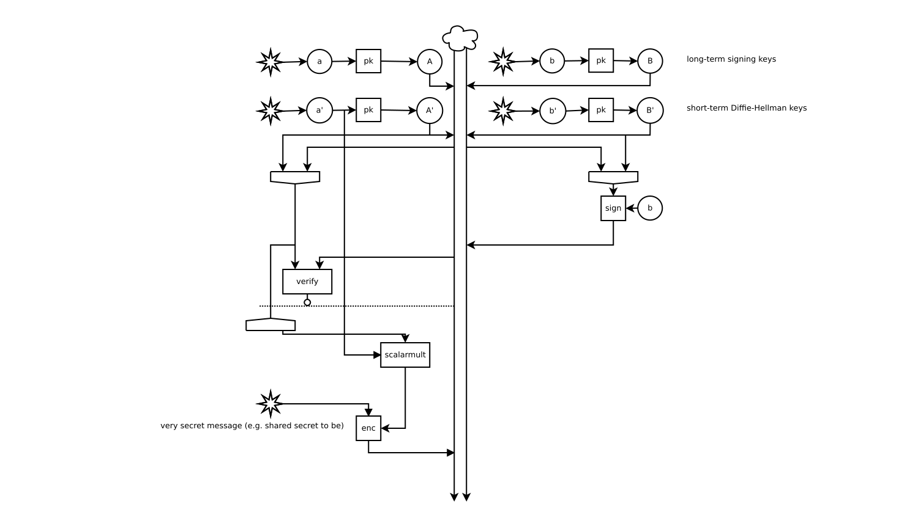
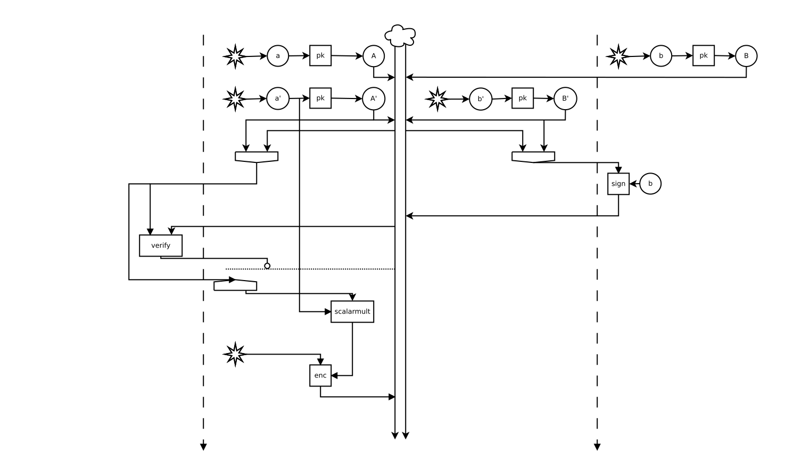
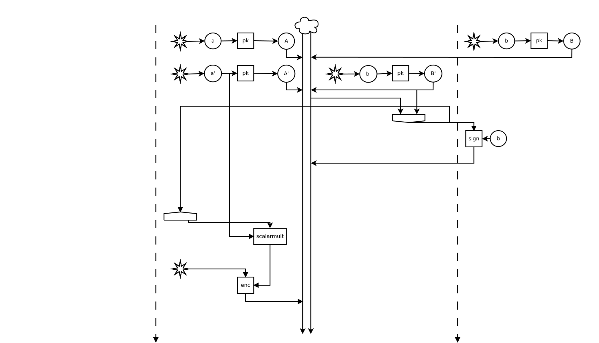

*For the same images in slide form, see [here](slides.html).*

I experimented some with representing cryptographic computations and
protocols graphically, with notation similar to electrical engineering
or digital signal processing circuits. This example will walk through
one execution of a simple one-way-authenticated key exchange protocol
and demonstrate that an execution of this form preserves confidentiality.

First, here is the (completely arbitrary) notation I will be using in
the diagrams.

- Randomness, the source of all power of cryptography, is represented
  using a star. Of course, there is a difference between drawing two
  arrows from the same random value (the same star) and combining two
  different random samples. The graph form encodes this naturally.
- I to use The Cloud to represent to adversary. If you prefer, imagine
  that it is full of horned red creatures or shady figures with black
  hats. Vertical lines below the cloud represent the information it
  has access to before outputting a particular message. This naturally
  encodes the "arrow of time", differentiating between a process that
  first verifies a signature and then reveals the signing key from one
  that does the opposite.
- When The Cloud is being good, any message from it is simply a copy
  of the latest message sent to it from the other side. Of course, our
  reasoning about the protocol does not assume anything that naive,
  but it may be helpful for understanding the intended execution of
  the protocol.
- Functions are represented by boxes, with special kind of boxes for
  for tupling/untupling. "More special" inputs are on the side by
  convention: for mux, the choice of which top input to use comes from
  the side; for functions that have secret and public inputs the
  secret input is on the side.
- A horizontal dashed line with a o-arrow going into it has the
  following semantics. If the input is true in some execution, the
  graph is executed as if the line wasn't there. If the input is
  false, all values created *below* the dashed line are replaced with
  dummy values (i.e., the protocol is aborted).
- ∃ stands for a value that is existentially quantified at the
  beginning of the lemma (as the big-O constant in complexity
  analysis).

The next image contains the protocol execution we will be
analyzing. The protocol is a subset of the
[SIGMA](http://webee.technion.ac.il/~hugo/sigma-pdf.pdf) authenticated
key agreement protocol, and perhaps the minimal key agreement protocol
built from Diffie-Hellman and Signatures that provides some (although
definitely not all) relevant security properties. The execution we are
analyzing is the canonical one: the two parties receive the same
number of inputs as if there was not an adversary, but these inputs
are controlled by the adversary.  After the shared key has been
established, the initiator of this execution proceeds to encrypt a
message using the shared secret. We will seek to derive that this
message remains confidential.

The following convention is used for symbols: capital letters
represent public keys and corresponding lowercase letters represent
corresponding secret keys. Furthermore, primed keys are short-term,
held by the same party that holds the corresponding unprimed key.

In arrows-and-messages notation, this protocol might be described as follows:

        —> gᵃ
        <— gᵇ, sig_B(gᵃ, gᵇ)
        —> E(gᵃᵇ, m)

{ width=100% }

Now, how are we going to establish that this protocol indeed provides
confidentiality for the message? We will use standard computational game-based
security definitions (e.g., [https://crypto.graphics/signature/](EUF-CMA)).
However, we are going to *first* transcribe the security definitions to
circuit format. This would be trivial for a two-worlds-style security definition
that completely characterizes the behavior of the primitive in question.
Single-experiment definitions need to be converted to two-worlds style first,
and then existentially quantified over behavior in the undefined cases.
For signatures, we get an indistinguishability statement that relates the
verification function to the following case-by-case logic:
if a secret key has been only used for signing, and verify with the
corresponding public key returns "valid", the message must be one of the ones
signed with that key.  Of course, if verify returns "invalid", the message from
the adversary may be anything at all. Either way, we do not get any guarantees
about the contents of the signature.

{ width=100% }

The choice between which side of the adversary the signing and verification are
drawn does not have semantic significance. However, it is best to stop and think
about the quantifiers in this statement for a moment. The adversary represents
universal quantification: the two sides must be indistinguishable for any
polynomial-time (in the implicit security parameter) probabilistic program run
in the cloud. Furthermore, the adversary is the same on the left and on the
right -- and it must behave the same as it cannot tell which side is executed.
However, the behavior of the simplified model on the right is just hidden
convenience: the function marked with ∃ figures out whether the adversary
returned a forgery or a previously signed message, and sets the select inputs to
the muxes accordingly. In principle, that definition could have been inlined to
the lemma statement, but it would not have been useful for anything and would
have cluttered the display. Thus, we shall be satisfied with just the fact that
such a decoder always exists. The entire experiment is also quantified over the
number of signing queries (we will discuss polynomial-time bounding issues
later).

Now we will seek to apply this lemma to our protocol execution. First, let's
separate out all the signing-related parts from the rest of the protocol. In the
next picture we have the same computation graph as before, laid out suggestively
using knowledge about the sign-verify lemma.

{ width=100% }

The long dashed vertical lines separate the signing part from the rest of the
protocol. For the purposes of the sign-verify lemma, the rest of the protocol
may as well be adversarial, and it would still hold. I.e., we fill the universal
quantifiers in the sign-verify lemma with a combination of the protocol
execution and the adversary interfering with it. After replacing the left-hand
side of the sign-verify lemma with the right-hand-side, we arrive at the
following:

{ width=100% }

The output boolean from the "valid" mux is connexted to the dashed horizontal
abort-if-false line. If the output is false, the argument that the secret
message at the end of the protocol is not leaked is trivial: all information
ever given to the adversary is independent from it. In graph computation terms,
there is no path from it to the adversary. Therefore, we will focus on the case
where the bottom output of ∃ makes a mux output its left input: true/"valid" to
the dashed horizontal line, and a real message instead of a forgery.

{ width=100% }

Now it is obvious that if this execution completes, the adversary may have
chosen from a glorious set of 1 alternatives for what message to relay to A.

{ width=100% }

Of course, a proof specific to a particular execution is underwhelming: for
example, the adversary may have initiated many sessions with B, pretending to be
A and C and maybe even B itself. To deal with all of these, we would like to
establish an invariant about the messages that B signs. In this case, the
invariant would say that the second component of any message signed by B known
to the adversary is a valid Diffie-Hellman public key whose secret key is held
by B and B only. To establish this by induction, we would need to prove that
every message sent by B does not leak a previously signed Diffie-Hellman key,
and that every signed message B sends indeed contains such a key.

Just any proof by induction isn't quite satisfactory in this context either.
Proving the statement "forall number of execution steps n, there exists a
polynomial time algorithm that in case of any break of this protocol breaks some
assumption" would construct an algorithm whose running time is polynomial in the
size of the protocol description, but grows arbitrarily fast with n. For
example, if the proof invoked the inductive hypothesis for all integers 1..n,
the total reduction would run in exponential time and be cryptographically
useless. Nevertheless, I think a proof of the weaker statement that can be
proven by induction is valuable as a heuristic for real-world security.
Of course, one could always move the existential out of the induction: specify a
concrete number of steps, as a function of n, in which the reduction algorithm
runs, and prove by induction that this is achievable for all n. That seems like
it would be really painful. Perhaps the best strategy would be to define a
limited form of induction that only allows running times polynomial in n. Maybe
restricting the use of the inductive hypothesis to top-level transitivity steps
could do the trick? (I actually don't know, it might as well just not help at all)

Either way, based on invariant or by inspecting the simple execution shown here,
we conclude that the message that passed signature verification must indeed
contain the pair (A', B').

{ width=100% }

We are now done reasoning about signatures. Note that while we were able to drop
the signature verification node from the computation graph because we figured
out what its output must be, there doesn't seem to be an easy way to drop the
signing node. I think this is because it is not obvious that something about the
signature or signing doesn't give adversary extra information that it could use
to attack the rest of the protocol.

The next step is to show that the shared secret generated from the
Diffie-Hellman keys is good. To do this, we use the Decision-Diffie-Hellman
assumption: no polynomial-time adversary can distinguish between (g^x, g^y,
g^xy) and (g^x, g^, g^z) with random x,y,z. Again, for the purpose of applying
this axiom, we refactor the protocol execution in a way that groups most of the
protocol nodes with the adversary. The protocol execution trivially polynomial-time,
so the DDH assumption applies to the compound adversary we construct this way.

{ width=100% }

Replacing the left-hand-side of the DDH assumption with the right-hand-side...

{ width=100% }

After applying DDH, we are simply encrypting a message with a random key that
the adversary does not have any information about. This is a trivial case of any
encryption confidentiality definition, for example
[IND-CCA2](https://crypto.graphics/IND-CCA2/). A lemma about ENC would say that
if a key has only been used for encryption and decryption, and has not been used
to used to decrypt (and give to the adversary) the very ciphertext in question,
the adversary cannot tell whether the ciphertext conceals one plaintext or
another. Therefore, we can just replace the plaintext with a dummy value.
With this, we have won: there is no more information flow from the secret
message to the adversary.

{ width=100% }

I expect that all steps shown here can be automated. I don't know whether there
is a precise term for the kind of regrouping and pattern-matching I did to apply
lemmas about crypto primitives, but I think an algorithm for it can reasonably
be constructed from any algorithm to perform unification on simply typed lambda
calculus by treating each node as a let binding of a primitive function applied
to outputs of previous nodes. Of course, this is for doing proofs about protocol
executions.

To prove something about all executions of a protocol, we will probably need
many of the same tricks as for reasoning about message-passing programs in the
absence of cryptography. I hope replacing reasoning about values with reasoning
about probabilistic computations will cause issues, but eh, I haven't tried.
Even with these tricks, there would be no general rule for coming up with
invariants to prove by induction, but it I hope it would be possible to prove an
invariant using the same techniques as I showed here for a single execution.
