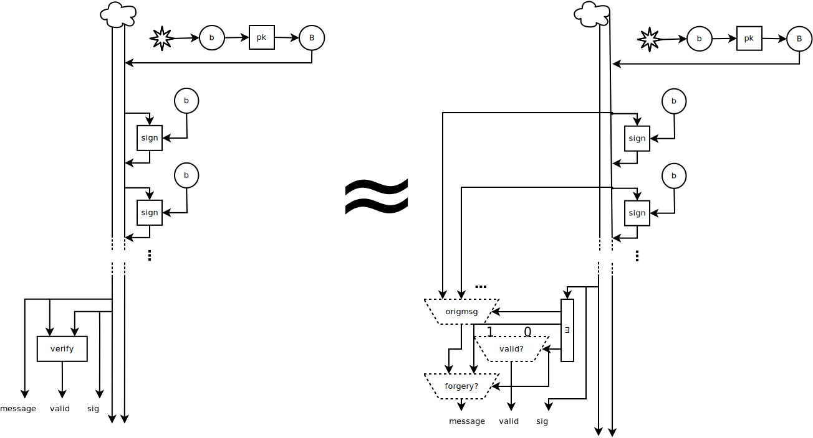

I experimented some with representing cryptographic computations and
protocols graphically, with notation similar to electrical engineering
or digital signal processing circuits. This example will walk through
one execution of a simple one-way-authenticated key exchange protocol
and demonstrate that an execution of this form preserves confidentiality.

First, here is the (completely arbitrary) notation I will be using in
the diagrams.

- Randomness, the source of all power of cryptography, is represented
  using a star. Of course, there is a difference between drawing two
  arrows from the same random value (the same star) and combining two
  different random samples. The graph form encodes this naturally.
- I to use The Cloud to represent to adversary. If you prefer, imagine
  that it is full of horned red creatures or shady figures with black
  hats. Vertical lines below the cloud represent the information it
  has access to before outputting a particular message. This naturally
  encodes the "arrow of time", differentiating between a process that
  first verifies a signature and then reveals the signing key from one
  that does the opposite.
- When The Cloud is being good, any message from it is simply a copy
  of the latest message sent to it from the other side. Of course, our
  reasoning about the protocol does not assume anything that naive,
  but it may be helpful for understanding the intended execution of
  the protocol.
- Functions are represented by boxes, with special kind of boxes for
  for tupling/untupling. "More special" inputs are on the side by
  convention: for mux, the choice of which top input to use comes from
  the side; for functions that have secret and public inputs the
  secret input is on the side.
- A horizontal dashed line with a o-arrow going into it has the
  following semantics. If the input is true in some execution, the
  graph is executed as if the line wasn't there. If the input is
  false, all values created *below* the dashed line are replaced with
  dummy values (i.e., the protocol is aborted).
- ∃ stands for a value that is existentially quantified at the
  beginning of the lemma (as the big-O constant in complexity
  analysis).

The next image contains the protocol execution we will be
analyzing. The protocol is a subset of the
[SIGMA](http://webee.technion.ac.il/~hugo/sigma-pdf.pdf) authenticated
key agreement protocol, and perhaps the minimal key agreement protocol
built from Diffie-Hellman and Signatures that provides some (although
definitely not all) relevant security properties. The execution we are
analyzing is the canonical one: the two parties receive the same
number of inputs as if there was not an adversary, but these inputs
are controlled by the adversary.  After the shared key has been
established, the initiator of this execution proceeds to encrypt a
message using the shared secret. We will seek to derive that this
message remains confidential.

The following convention is used for symbols: capital letters
represent public keys and corresponding lowercase letters represent
corresponding secret keys. Furthermore, primed keys are short-term,
held by the same party that holds the corresponding unprimed key.

In arrows-and-messages notation, this protocol might be described as follows:

        —> gᵃ
        <— gᵇ, sig_B(gᵃ, gᵇ)
        —> E(gᵃᵇ, m)

{ width=100% }

{ width=100% }

{ width=100% }

{ width=100% }

{ width=100% }

{ width=100% }

{ width=100% }

{ width=100% }

{ width=100% }

{ width=100% }
